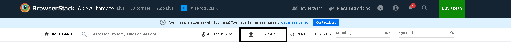
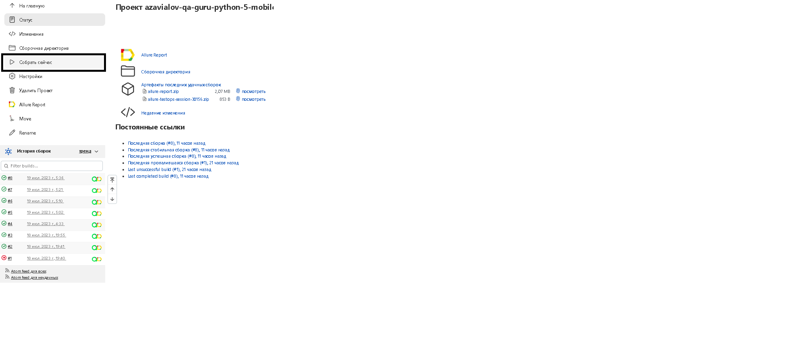
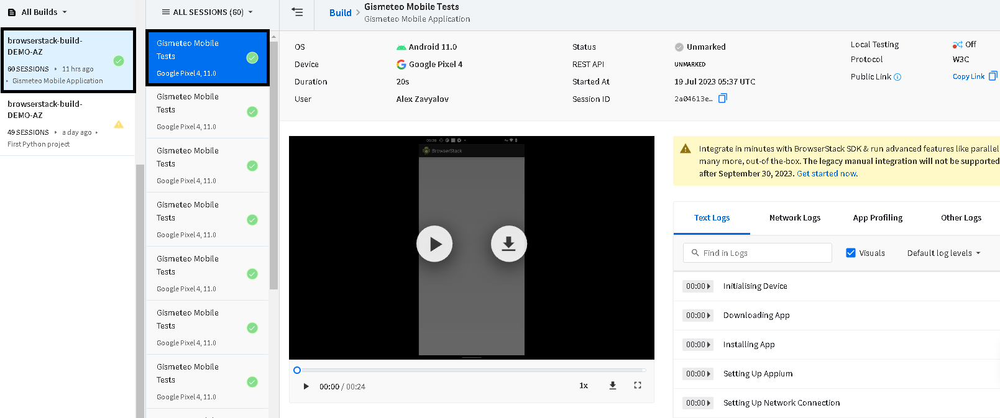
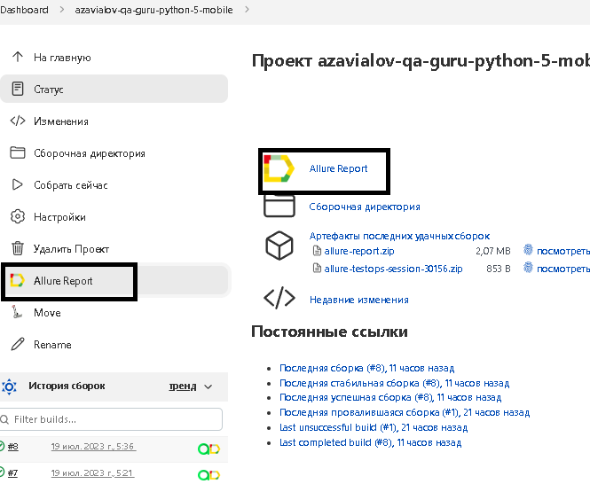
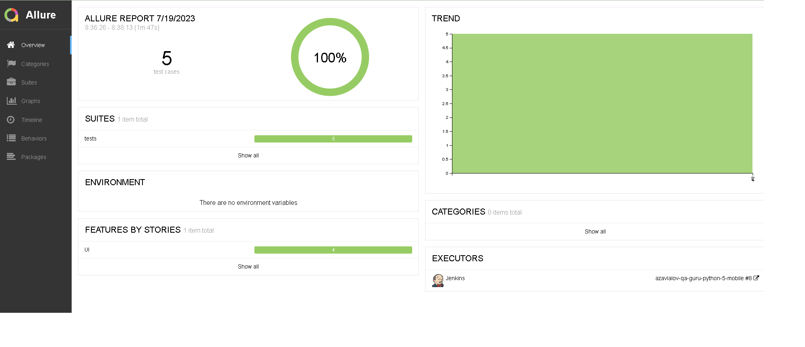
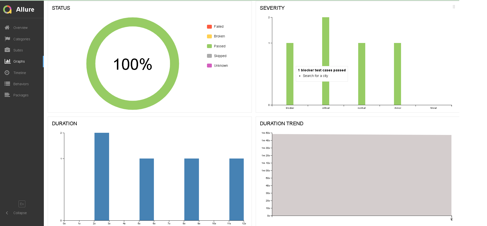
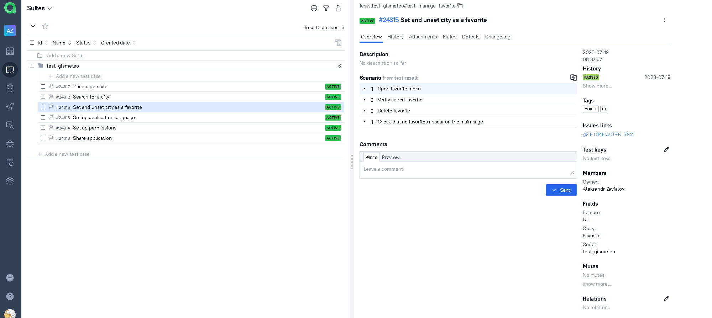
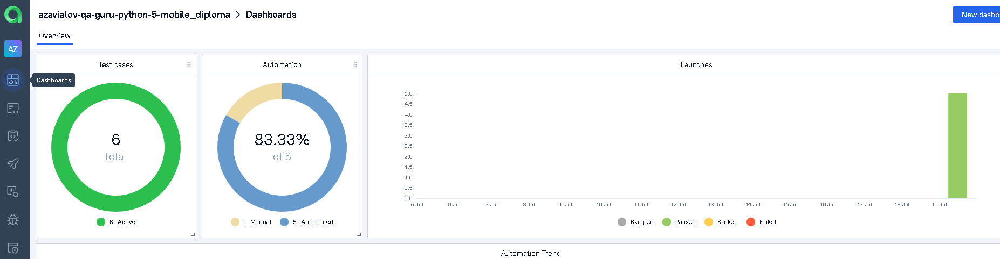
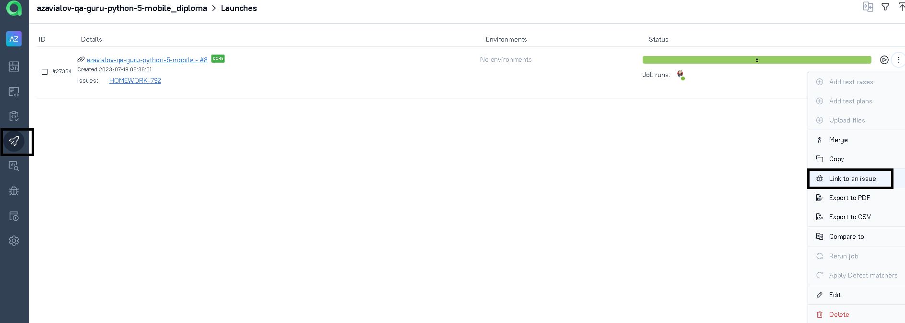

## Проект мобильных автотестов для приложение GisMeteo на операционной системе Android

### Основные моменты

- Тест-кейсы разработаны на языке Python с использованием фреймворков Selene, Pytest. 

- Используется Allure Reports для  генерации отчетности и интерграции с системой тест-менеджмента Allure Test Ops

- Реализована интеграция с системой трекинга ошибок Jira

- Оповещение о результатах выполнения тестов приходят в Telegram

- Тесты можно запустить как локально c помощью эмулятора устройства, так и на удаленной ферме устройств с использованием CI - системы Jenkins

## Используемые технологии

  <code></code>
  <code></code>
  <code></code>
  <code></code>
  <code></code>
  <code></code>
  <code></code>
  <code></code>
  <code></code>
  <code></code>
  <code></code>
  <code></code>
  <code></code>
  <code></code>

## Реализованные тест-кейсы

- Поиск города и валидация меню погоды найденного города
- Смена языка приложения
- Работа с правами приложения
- Работа с разделом избранного
- Меню "Поделиться" 

## Настройка проекта для удаленного запуска
- Создать аккаунт на browserstack.com и загрузить apk-файл приложения 

- Настроить запуск тестов из [Jenkins](https://jenkins.autotests.cloud/job/azavialov-qa-guru-python-5-mobile/) и нажать "Собрать сейчас"

- Информация о прохождении тестов доступна в BrowserStack и Allure - отчете сборки

- Во вложениях Allure отчетах прикрепляются видео и скриншоты

## Настройка проекта для локального запуска

Для локального запуска:
1. Установить Git, Poetry, Pycharm
2. Клонировать репозиторий в Pycharm
3. Создать виртуальную среду командой poetry shell, для установки зависимостей запустить poetry install
4. Выбрать интерпретатор Python
5. Для работы с Browserstack задать настройки в файле config.browserstack.env.example и удалить '.example' из названия
6. Для работы с эмуляцией установить Android Studio, Appium server, Appium inspector
   - Запустить Android Studio, открыть Virtual Device Manager и скачать образ Google Pixel 4 на Android 11
   - Запустить устройство, Appim Server, Appium Inspector, настроить Desired Capabilities в Appium Inspector
7. Для выбора среды запуска либо передать аргумент context при запуске тестов из командной стройки
env -S "context=browserstack" pytest . --alluredir allure-results/ - для запуска тестов в browserstack
env -S "context=emulation" pytest . --alluredir allure-results/ - для запуска тестов в эмуляторе
8 Получить Allure отчет командой allure serve

## Возможности Allure Reports
- В разделе Overview отображается сводная информация

- В разделе Graphs доступна статистика прохождения тест-кейсов

## Интеграция с Allure TestOps 
После выполнения в Allure Test Ops создаются тест-кейсы с уже заполненными шагами, которые берутся из лямбда-степов внутри тест-кейсов

В этом же списке можно вручную добавить ручной тест-кейс
Суммарная информация по автоматизированным и ручным кейсам доступна в дашборде

## Интеграция с Jira
К уже созданной в Jira задаче в разделе сьютов Allure Test Ops можно привязать тест-кейсы

Из раздела Launches можно привязать тестовый прогон

## Настроена отправка отчета в Telegram

